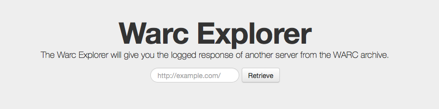

# Warc Explorer

> Warc Explorer is a Node.js web application for exploring WARC files (`.warc`), used for scavenging the Internet's past.



## Install
[](https://asciinema.org/a/40058)

## Usage
The Warc Explorer only works on individual WARC archives rather than a folder of them.
The file can either be `.warc` (raw) or `.warc.gz` (compressed).

```
$ bin/warc-explorer archive.warc.gz 
Booting the warc-explorer...
Listening on localhost:8080
```

Now you can browse to `localhost:8080`, plug in a URL and start chugging.

## Configuration
You can configure the host and port to listen on by using the respective `HOST` and `PORT` environment variables.

```sh
$ HOST=0.0.0.0 PORT=80 bin/warc-explorer 03-21-2016.warc
Booting the warc-explorer...
Listening on 0.0.0.0:80
```

## Notes
When you request a page, the Warc Explorer will send you the entire server's response *plain*. This means that header variables, etc
come straight from the server it was archived from and they are *not* cleansed.

It will also not automatically change other URLs and referenced material in the website; if you request an archived website that has
a CSS sheet, for example, it will request that back to the original URI rather than an updated, archive URI.

## License
MIT license
